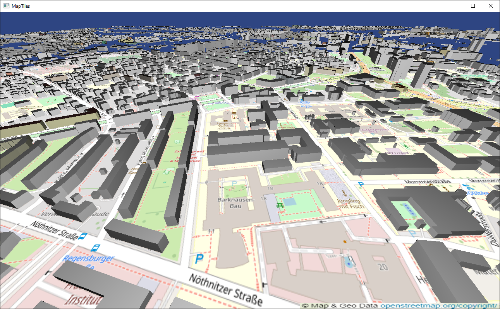

# MapTiles


## Table of Contents
- [About the Project](#about-the-project)
- [Building](#building)
- [Usage](#usage)
- [Configuration](#configuration)

## About the Project
MapTiles is a real-time 3D enviornment visualizer. It fetches geographical data from OpenStreetMap and constructs and renders a 3D scene in real-time.

## Building
To build, create a build folder in the root directory and run the CMake script. This can be done using the following commands:
```cmd
mkdir build
cd build
cmake ..
```
Once the build is configured, you can build the project by running:
```cmd
cmake --build .
```
or by compiling the project using the selected build system (for example, visual studios on windows).

## Usage
The application can be used for any city for which geographical data are available in the OpenStreetMap database. To render the 3D map of a city, run the following command:
```cmd
MapTiles.exe <latitude> <longitude>
```
Replace "latitude" and "longitude" (and the angular brackets) with the latitude and longitude of the city. When no arguments are provided, the application defaults to the city of Dresden, Germany.

## Configuration
Certain settings for the application be configured via the `Config.h` file.
* `Tile3DSize`
  * Controls the size of individual `Tile3Ds`. Specified in degrees.
* `NeighbourhoodFetchSizeRasterTile`
  * Controls the grid size for the `RasterTiles`. A grid size of `n` results in a `(2*n+1)x(2*n+1)` grid.
* `NeighbourhoodFetchSizeTile3D`
  * Controls the grid size for the `Tile3Ds`. A grid size of `n` results in a `(2*n+1)x(2*n+1)` grid.
* `FrustumBasedTileGeneration`
  * Enables frustum based tile generation which will fetch and render all the tiles inside the view frustum.
* `FrustumRasterTilesCount`
  * Limits the maximum number of `RasterTiles` along any one axis when `FrustumBasedTileGeneration` is enabled.
* `FrustumTile3DMaxDistance`
  * Limits the number of `Tile3Ds` generated along any one axis based on distance from the camera when `FrustumBasedTileGeneration` is enabled. The distance is measured in degrees.
* `MaxFPS`
  * Sets the maximum framerate for the application. Can be used to reduce the load on the CPU and the GPU. `MaxFPS <= 0` leaves the framerate limit uncapped.
